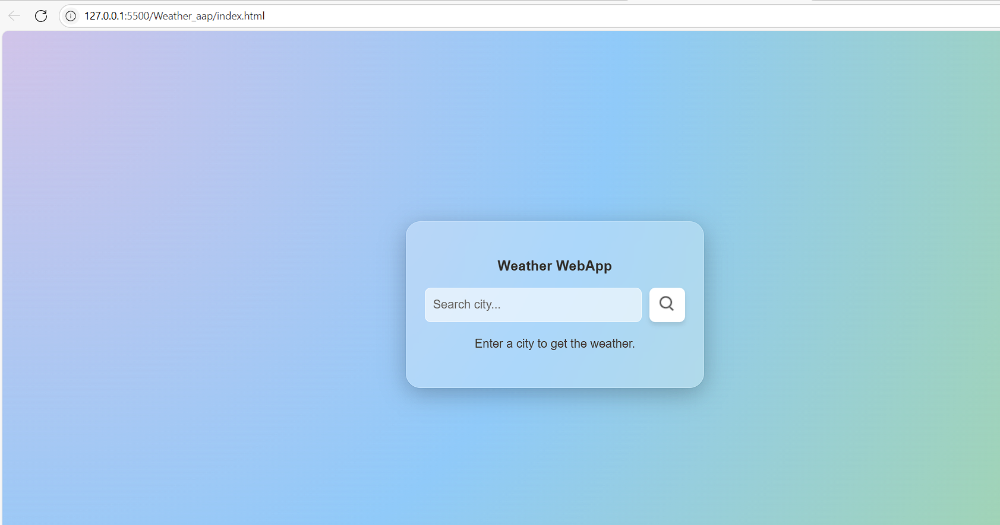

# Weather WebApp.

A sleek and responsive weather application built using **HTML**, **CSS**, and **JavaScript**, powered by the **OpenWeatherMap API**. 
This app displays real-time weather data such as temperature, humidity, wind speed, and weather conditions with dynamic icons — all wrapped in a modern glassmorphism user interface.

**This is my first CodTech task.**

## Features.

- Search weather by city name 
- Real-time temperature in Celsius 
- Humidity level with icon 
- Wind speed with icon 
- Dynamic weather icons (clear, rain, snow, drizzle, clouds) 
- Smooth animations & modern UI 
- Mobile-responsive layout 

## Demo.

 

## Technologies Used.

HTML5 
CSS3 (Glassmorphism, Flexbox, Animations) 
JavaScript (ES6+) 
OpenWeatherMap API 

##  Project Structure.
WeatherWebApp/
│
├── index.html # Main HTML file
├── style.css # Styling (glassmorphism + responsive)
├── script.js # JS logic and API interaction
├── README.md # Project documentation
└── images/ # Weather icons (clear, rain, cloud, snow, etc.)

Author.
Shrihari Gosavi 
Feel free to reach out or contribute! 
GitHub Profile 
